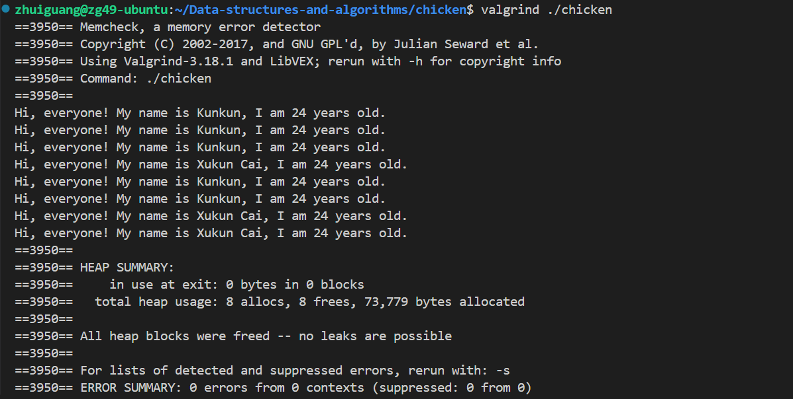
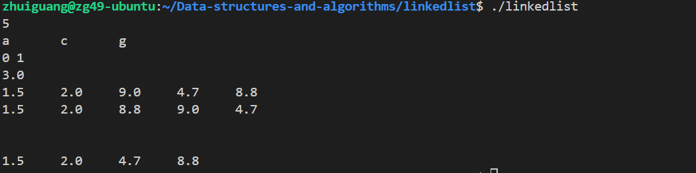

# 数据结构与算法 2024秋 课程仓库

## Big Project：四则混合运算器

>`/hybridOperators`目录下

### **项目简介**
本项目实现了一个功能全面的四则混合运算表达式求值器，支持解析中缀表达式并计算结果。程序能够正确处理多种输入格式，并对非法表达式进行准确检测和处理。

### **功能特性**
1. **支持的运算**：
  - 四则运算（加 `+`、减 `-`、乘 `*`、除 `/`）。
  - 括号嵌套优先级解析。
  - 小数、负数和科学计数法的运算（如 `1.5+2.25`, `1.2e3-1e2`）。
2. **错误检测**：
  - 括号匹配错误（如 `(1+2`）。
  - 非法字符检测（如 `abc+1`）。
  - 连续运算符检测（如 `1++2`）。
  - 零除检测（如 `1/0`）。
3. **结果处理**：
  - 合法表达式输出计算结果。
  - 非法表达式返回 `"ILLEGAL"`。
4. **用户交互**：
  - 支持通过终端输入表达式进行实时计算。


### **编译与运行**
1. 使用 `make` 命令编译程序：编译完成后会生成可执行文件 `evaluator`。

- 程序将自动运行预定义的测试用例，并输出每个表达式的结果。
- 程序支持交互模式，可输入自定义表达式进行计算，输入 `exit` 可退出程序。

2. 使用 `make report` 命令生成 PDF 格式的实验报告。

3. 使用 `make clean` 清理生成的中间文件，但保留 PDF 报告。

### **示例运行结果**
运行 `evaluator` 后的部分输出示例：
```plaintext
Running predefined test cases:

Expression: 1+2 -> Result: 3.000000
Expression: 1-2 -> Result: -1.000000
Expression: 1/0 -> Result: ILLEGAL
Expression: 1+-2.1 -> Result: -1.100000
Expression: (1+2)*3 -> Result: 9.000000

Interactive mode:

Enter an expression (or type 'exit' to quit): 1.2e3+1e-3
Result: 1200.000001

Enter an expression (or type 'exit' to quit): exit
```

## Lab 1

hello目录下编写源文件hello.cpp，Makefile，make后可得到可执行文件hello，运行后显示"Hello World!"。

## Lab 2 (Chicken)

1. **深度拷贝与连续赋值：**

* **复制操作:**
在拷贝对象时，为`name`动态分配新的内存，并将源对象的`name`内容复制到新对象中，确保两个对象拥有独立的内存。

* **赋值操作符重载:**
重载`operator = `，在赋值时进行深拷贝，返回`*this`，支持了连续赋值。且每个对象独立地管理自己的内存，避免指针共享导致的潜在问题。

2. **内存管理**

* 在`setName()`和赋值运算符中检查并释放旧的`name`内存，避免内存泄漏，通过`delete[]`释放动态分配的内存，使得对象析构时不会产生内存泄漏。
* 在赋值运算符中，检查`this != &other`，避免自我赋值导致错误的内存释放。

3. **左值引用、指针和`const`关键字**：
* 使用`const`关键字保护`getName`和`getAge`，保证这些函数不会被修改对象成员，并且在传递对象时使用`const`引用。

4. **valgrind检查内存泄漏：**
截图如下



## Lab 3 Linkedlist

1. **`getCurrentVal()`：**
- 当`currentPos`不为`nullptr`时返回当前节点的值，如果`currentPos`为`nullptr`，报错`Empty current position! Can't get value!`。

2. **`setCurrentVal(T &_val)`：**
- 确保`currentPos`不为`nullptr`时允许修改数据，如若为`nullptr`则报错`Empty current position! Can't setvalue!`

3. **`isEmpty()`：**
- 修改了老妖的拼写错误（手动狗头）。
- 检查链表是否为空，返回`true`表示链表为空，`false`表示链表不为空。

4. **`insert(T _val)`：**
- 如果`currentPos`为`nullptr`，表示链表为空，将元素插入为新的头结点，并更新`currentPos`指向新插入的节点；若`currentPos`不为空，则在其后插入新节点,并更新`currentPos`。
- 插入后，链表的大小增加。

5. **`remove()`：**
>`remove()`函数原先删除的是`currentPos`后面的元素而非`currentPos`指向的当前元素，这不符合实际工作的需求，我们将其改为删除`currentPos`**指向的元素本身**。
- 如若链表为空或`currentPos`为空，则不进行任何操作。
- 若`currentPos`是链表的头结点，删除头结点并更新`head`和`currentPos`。
- 如若`currentPos`不是链表的头结点，删除该节点并更新`currentPos`为其后的节点。
- 删除后，链表的大小减小

**修改了remove()函数后的输出：**



## Lab4 List

1. **`List.h`**

- 在 `List.h` 中，添加了迭代器**后向遍历**（`--`）的实现，使得`List`支持使用迭代器进行双向遍历。

2. **`List.cpp`**<br>
在`List.cpp`中，我们编写了测试程序，覆盖以下操作验证`List`类的正确性
- 元素插入（`push_back`、`push_front`）
- 元素删除（`pop_back`、`pop_front`、`erase`）
- 前向和后向迭代器遍历
- 拷贝构造和移动构造
- 拷贝赋值和移动赋值
- 链表的清空操作

3. **无内存泄漏：**<br>
我们使用`Valgrind`工具检测确保程序无内存泄漏，截图如下：


## Lab5 BST_remove

1. `BinarySearchTree.h`的修改

    我们优化了 `BinarySearchTree` 类中的 `remove` 函数，避免递归删除过程中不必要的节点值复制操作。为此，我们新增了一个辅助函数 `detachMin`，用于从右子树中找到并移除最小节点。这样在删除有两个子节点的节点时，可以直接使用 `detachMin` 返回的节点进行替换，从而提高删除操作的效率。

2. `main.cpp`的测试

    在 `main.cpp` 中，我们编写了多种测试用例，验证 `remove` 函数在以下场景中的正确性：
    - 删除不存在的节点，确保树结构不变。
    - 删除叶子节点，确保其成功移除且不影响其他节点。
    - 删除只有一个子节点的节点，验证树的结构更新正确。
    - 删除有两个子节点的节点，确保 `remove` 函数能正确替换节点。
    - 删除根节点，包括根节点有多个子节点的情况。
    - 重复删除同一节点，测试函数是 
    我们编写了一个 `Makefile`，提供了以下两种操作：
   - `make run`：编译 `main.cpp` 并运行程序，输出测试结果。
   - `make report`：使用 `xelatex` 编译实验报告 `report.tex`，生成 `report.pdf` 文件。

    此外，可以使用 `make clean` 清理临时文件，或使用 `make distclean` 完全清理生成的文件。

## Lab6 AVLTree_remove

### 实现方案

本次实现主要围绕AVL树的平衡维护，核心在于正确处理删除操作后的再平衡：

1. 节点存储结构
```cpp
struct BinaryNode {
    Comparable element;
    BinaryNode *left;
    BinaryNode *right;
    int height;  // 新增高度字段
};
```

2. 高度维护
```cpp
// 获取节点高度
int height(BinaryNode *t) const {
    return t == nullptr ? 0 : t->height;
}

// 更新节点高度
void updateHeight(BinaryNode *t) {
    if (t != nullptr) {
        t->height = std::max(height(t->left), height(t->right)) + 1;
    }
}
```

3. AVL树的删除操作
- 先按二叉搜索树的方式删除节点
- 删除后自底向上更新节点高度
- 检查平衡因子进行必要的旋转
- 通过递归返回保持树的平衡性

4. 平衡维护
```cpp
int getBalance(BinaryNode *t) const {
    return t == nullptr ? 0 : height(t->left) - height(t->right);
}
```

### Makefile使用说明

#### 基本命令
```bash
make        # 编译程序
make run    # 运行程序
make clean  # 清理编译文件，保留PDF
make report # 生成PDF报告
make time   # 测试运行时间
```
>可能会遇到栈溢出的问题，使用前建议设置 `ulimit -s unlimited`，该命令只对当前shell有效

## Lab7 HeapSort

### **实现思路**
实现了基于大顶堆的堆排序（HeapSort），包括以下关键步骤：

1. **构建大顶堆**：从最后一个非叶节点开始向上堆化，时间复杂度为 $O(n)$。

2. **排序过程**：
   - 将堆顶元素与堆尾元素交换，将最大值放在数组末尾。
   - 对堆顶元素执行堆化操作，恢复堆的性质。
   - 重复上述操作，直到所有元素排序完成。

3. **关键函数**：
   - `siftDown`: 用于堆化操作，从指定节点开始恢复堆性质。
   - `heapSort`: 堆排序主函数，完成建堆与排序过程。

### **测试**
测试代码位于 `test.cpp`，包含以下功能：
1. **排序正确性验证**：通过 `check` 函数确保排序结果正确。
2. **性能测试**：对以下四种序列进行排序并记录时间：
    - 随机序列
    - 有序序列
    - 逆序序列
    - 部分重复序列
3. **与标准库对比**：并使用 `std::sort_heap()` 进行了性能对比。

