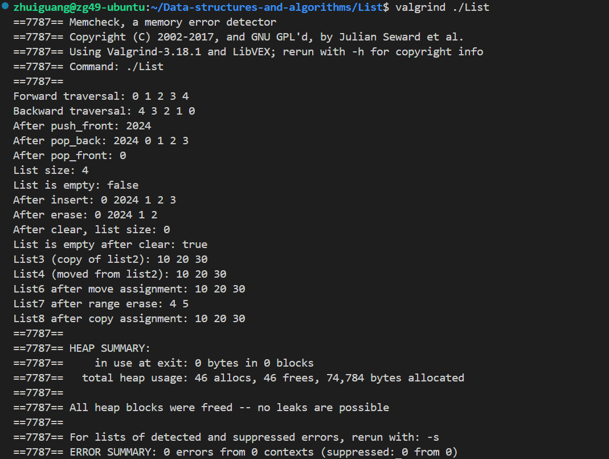

# 数据结构与算法 2024秋 课程仓库
## Lab 1

hello目录下编写源文件hello.cpp，Makefile，make后可得到可执行文件hello，运行后显示"Hello World!"。

## Lab 2 (Chicken)

1. **深度拷贝与连续赋值：**

* **复制操作:**
在拷贝对象时，为`name`动态分配新的内存，并将源对象的`name`内容复制到新对象中，确保两个对象拥有独立的内存。

* **赋值操作符重载:**
重载`operator = `，在赋值时进行深拷贝，返回`*this`，支持了连续赋值。且每个对象独立地管理自己的内存，避免指针共享导致的潜在问题。

2. **内存管理**

* 在`setName()`和赋值运算符中检查并释放旧的`name`内存，避免内存泄漏，通过`delete[]`释放动态分配的内存，使得对象析构时不会产生内存泄漏。
* 在赋值运算符中，检查`this != &other`，避免自我赋值导致错误的内存释放。

3. **左值引用、指针和`const`关键字**：
* 使用`const`关键字保护`getName`和`getAge`，保证这些函数不会被修改对象成员，并且在传递对象时使用`const`引用。

4. **valgrind检查内存泄漏：**
截图如下

## Lab 3 Linkedlist

1. **`getCurrentVal()`：**
- 当`currentPos`不为`nullptr`时返回当前节点的值，如果`currentPos`为`nullptr`，报错`Empty current position! Can't get value!`。

2. **`setCurrentVal(T &_val)`：**
- 确保`currentPos`不为`nullptr`时允许修改数据，如若为`nullptr`则报错`Empty current position! Can't setvalue!`

3. **`isEmpty()`：**
- 修改了老妖的拼写错误（手动狗头）。
- 检查链表是否为空，返回`true`表示链表为空，`false`表示链表不为空。

4. **`insert(T _val)`：**
- 如果`currentPos`为`nullptr`，表示链表为空，将元素插入为新的头结点，并更新`currentPos`指向新插入的节点；若`currentPos`不为空，则在其后插入新节点,并更新`currentPos`。
- 插入后，链表的大小增加。

5. **`remove()`：**
>`remove()`函数原先删除的是`currentPos`后面的元素而非`currentPos`指向的当前元素，这不符合实际工作的需求，我们将其改为删除`currentPos`**指向的元素本身**。
- 如若链表为空或`currentPos`为空，则不进行任何操作。
- 若`currentPos`是链表的头结点，删除头结点并更新`head`和`currentPos`。
- 如若`currentPos`不是链表的头结点，删除该节点并更新`currentPos`为其后的节点。
- 删除后，链表的大小减小

**修改了remove()函数后的输出：**

## Lab4 List

1. **`List.h`**

- 在 `List.h` 中，添加了迭代器**后向遍历**（`--`）的实现，使得`List`支持使用迭代器进行双向遍历。

2. **`List.cpp`** 
在`List.cpp`中，我们编写了测试程序，覆盖以下操作验证`List`类的正确性
- 元素插入（`push_back`、`push_front`）
- 元素删除（`pop_back`、`pop_front`、`erase`）
- 前向和后向迭代器遍历
- 拷贝构造和移动构造
- 拷贝赋值和移动赋值
- 链表的清空操作

3. **无内存泄漏：** 
我们使用`Valgrind`工具检测确保程序无内存泄漏，截图如下：

## Lab5 BST_remove

1. `BinarySearchTree.h`的修改

    我们优化了 `BinarySearchTree` 类中的 `remove` 函数，避免递归删除过程中不必要的节点值复制操作。为此，我们新增了一个辅助函数 `detachMin`，用于从右子树中找到并移除最小节点。这样在删除有两个子节点的节点时，可以直接使用 `detachMin` 返回的节点进行替换，从而提高删除操作的效率。

2. `main.cpp`的测试

    在 `main.cpp` 中，我们编写了多种测试用例，验证 `remove` 函数在以下场景中的正确性：
    - 删除不存在的节点，确保树结构不变。
    - 删除叶子节点，确保其成功移除且不影响其他节点。
    - 删除只有一个子节点的节点，验证树的结构更新正确。
    - 删除有两个子节点的节点，确保 `remove` 函数能正确替换节点。
    - 删除根节点，包括根节点有多个子节点的情况。
    - 重复删除同一节点，测试函数是否能正确处理已不存在的节点。

3. `Makefile`的使用

    我们编写了一个 `Makefile`，提供了以下两种操作：
   - `make run`：编译 `main.cpp` 并运行程序，输出测试结果。
   - `make report`：使用 `xelatex` 编译实验报告 `report.tex`，生成 `report.pdf` 文件。

    此外，可以使用 `make clean` 清理临时文件，或使用 `make distclean` 完全清理生成的文件。
